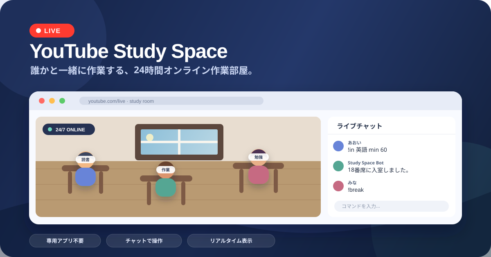
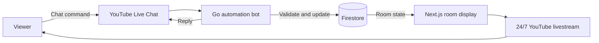

<div align="center">

# YouTube Study Space

**A 24/7 virtual room for studying, working, creating, and getting things done together.**

<a href="https://www.youtube.com/channel/UCXuD2XmPTdpVy7zmwbFVZWg/live">
  
</a>

<p>
  <a href="https://www.youtube.com/channel/UCXuD2XmPTdpVy7zmwbFVZWg/live"></a>
  <a href="https://sorarideblog.github.io/youtube-study-space/en/docs/essential"></a>
  <a href="https://github.com/kani3camp/youtube-study-space/issues/new/choose"></a>
</p>

[Enter the live room](https://www.youtube.com/channel/UCXuD2XmPTdpVy7zmwbFVZWg/live) · [Read the command guide](https://sorarideblog.github.io/youtube-study-space/en/docs/essential) · [日本語](./README.md)

</div>

---

YouTube Study Space turns a YouTube livestream into a shared online work room.
Join a virtual seat through live chat, show what you are working on, take a break, resume, and leave when you are done — without installing a dedicated app.

Despite the name, this space is not limited to schoolwork. People use it for coding, reading, writing, remote work, exercise, cleaning, meditation, games, and any other activity that benefits from a little shared presence.

## Start in less than a minute

1. Open the **[current YouTube livestream](https://www.youtube.com/channel/UCXuD2XmPTdpVy7zmwbFVZWg/live)**.
2. Send `!in` in live chat.
3. The bot assigns you an available seat and your name appears in the virtual room.
4. Send `!out` when you finish.

```text
!in
```

You can also include a work name and an automatic exit time:

```text
!in English study min 60
```

> [!IMPORTANT]
> Live chat messages are public, and your work name may be shown on the stream. Do not include private or sensitive information.

## Useful commands

| What you want to do | Command example |
| --- | --- |
| Join an available seat | `!in` |
| Join and show your current task | `!in Reading` |
| Join for up to 45 minutes | `!in Writing min 45` |
| Start a break | `!break` |
| Resume working | `!resume` |
| Check your current information | `!info` |
| Leave the room | `!out` |

The command system has more options, including selecting a seat, extending a session, viewing rankings, ordering virtual menu items, and using member-only seats.
See the **[full command guide](https://sorarideblog.github.io/youtube-study-space/en/docs/essential)** for details and language options.

## What makes the room different

- **Always available** — the project is designed as an automated 24/7 work space.
- **Uses your existing YouTube experience** — no separate Study Space account or custom app is required.
- **Visible shared presence** — participants occupy seats in the room and can display what they are doing.
- **Flexible sessions** — set a task, choose a duration, take breaks, resume, or extend your time.
- **Personal activity features** — check work information and participate in rankings.
- **Member spaces** — YouTube members can use dedicated member-only seats.
- **Automatic room management** — seat allocation, time limits, live-state checks, and routine maintenance are handled by the system.

## A room for more than studying

| Study & learning | Work & making | Everyday routines |
| --- | --- | --- |
| Exam preparation | Coding | Cleaning |
| Reading | Writing | Exercise |
| Language learning | Planning | Meditation |
| Online courses | Creative work | Games and hobbies |

The goal is simple: make it easier to begin, stay present, and finish alongside other people who are also doing something.

## How it works

The livestream, chat bot, room display, and cloud services work together as one automated system.
This is a simplified view:



When a command arrives, the backend parses it, validates the requested action, updates the room state in a Firestore transaction, and posts a response when needed. The monitor reads the current state and renders the virtual room shown in the livestream. Scheduled AWS workloads handle recurring maintenance and analytics tasks.

<details>
<summary><strong>Repository map for technically curious visitors</strong></summary>

| Path | Role |
| --- | --- |
| [`system/`](./system) | Go backend, YouTube chat integration, room logic, scheduled jobs, and Lambda entrypoints |
| [`youtube-monitor/`](./youtube-monitor) | Next.js interface rendered in the livestream |
| [`docs-site/`](./docs-site) | Multilingual Docusaurus command documentation |
| [`aws-cdk/`](./aws-cdk) | AWS infrastructure as code |
| [`firebase/`](./firebase) | Firestore configuration and security rules |
| [`tools/`](./tools) | Supporting generators, simulators, and operational utilities |

The main stack includes Go, TypeScript, Next.js, Firestore, BigQuery, AWS Lambda, ECS Fargate, Step Functions, and CDK.

</details>

## Found a problem or have an idea?

You do **not** need programming knowledge to report something.
Choose a guided form on the **[new issue page](https://github.com/kani3camp/youtube-study-space/issues/new/choose)** for unexpected behavior, confusing instructions, display problems, command failures, or improvement ideas.

A useful report includes:

- what you were trying to do;
- the command you sent, if any;
- what happened and what you expected instead;
- the approximate date and time, preferably with your time zone;
- a screenshot or short screen recording when helpful.

Please remove personal information, access tokens, private messages, and anything else that should not be public before submitting.

## Links

- **[Enter the live room](https://www.youtube.com/channel/UCXuD2XmPTdpVy7zmwbFVZWg/live)**
- **[Command guide](https://sorarideblog.github.io/youtube-study-space/en/docs/essential)**
- **[Public project information](https://youtube-study-space.notion.site/5021213988a34747a7513f1067deb76d)**
- **[Discord community](https://discord.gg/h9SenAvawT)**
- **[Development story on Zenn](https://zenn.dev/soraride/articles/a546dbfc4bb6ee)**
- **[Japanese README](./README.md)**

## Terms of use

The source code is publicly viewable, but this repository uses project-specific terms rather than a standard open-source license. Viewing, local personal use, modification, redistribution, and other uses are governed by the repository's **[Terms of Use](./LICENSE)**.
