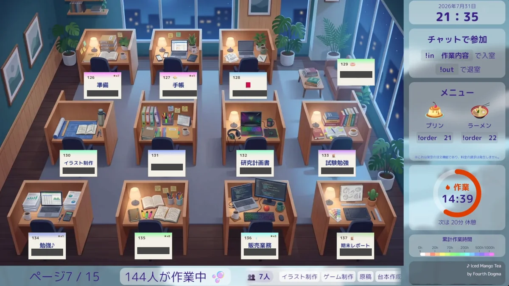
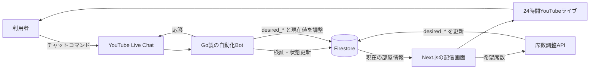

<div align="center">

# YouTube Study Space

**勉強・仕事・創作・日々の作業を、誰かと一緒に進めるための24時間オンライン作業部屋。**

<a href="https://www.youtube.com/channel/UCXuD2XmPTdpVy7zmwbFVZWg/live">
  
</a>

<p>
  <a href="https://www.youtube.com/channel/UCXuD2XmPTdpVy7zmwbFVZWg/live"></a>
  <a href="https://kani3camp.github.io/youtube-study-space/"></a>
  <a href="https://github.com/kani3camp/youtube-study-space/issues/new/choose"></a>
</p>

[ライブ配信に入る](https://www.youtube.com/channel/UCXuD2XmPTdpVy7zmwbFVZWg/live) · [コマンド一覧を見る](https://kani3camp.github.io/youtube-study-space/) · [English](./README.en.md)

</div>

---

YouTube Study Spaceは、YouTubeライブ配信をみんなで使えるオンライン作業部屋にするプロジェクトです。
ライブチャットから仮想の席に座り、取り組んでいる作業を表示し、休憩・再開・退室まで操作できます。専用アプリのインストールは必要ありません。

「自習室」という名前ですが、利用目的は勉強に限りません。仕事、プログラミング、読書、創作、運動、掃除、瞑想、ゲームなど、誰かと一緒にいる感覚が少し欲しいあらゆる作業に使えます。

## 1分で参加できます

1. **[現在のYouTubeライブ配信](https://www.youtube.com/channel/UCXuD2XmPTdpVy7zmwbFVZWg/live)**を開きます。
2. ライブチャットに `!in` と書き込みます。
3. 空いている席が自動で割り当てられ、配信画面に名前が表示されます。
4. 作業が終わったら `!out` で退室します。

```text
!in
```

作業名や自動退室までの時間も指定できます。

```text
!in 英語の勉強 min 60
```

> [!IMPORTANT]
> ライブチャットへの投稿は公開され、作業名も配信画面に表示されることがあります。個人情報や機密情報は入力しないでください。

## よく使うコマンド

| やりたいこと | コマンド例 |
| --- | --- |
| 空いている席に入室する | `!in` |
| 作業内容を表示して入室する | `!in 読書` |
| 45分後に自動退室する | `!in 資料作成 min 45` |
| 休憩を開始する | `!break` |
| 作業を再開する | `!resume` |
| 自分の情報を確認する | `!info` |
| 退室する | `!out` |

席番号の指定、作業時間の延長、ランキング、仮想メニューの注文、メンバー限定席など、ほかにもさまざまな機能があります。
詳しい使い方は **[コマンド一覧](https://kani3camp.github.io/youtube-study-space/)** をご覧ください。

## この作業部屋の特徴

- **24時間いつでも利用可能** — 自動運用を前提としたオンライン作業スペースです。
- **YouTubeからそのまま参加** — 専用のアプリやStudy Space用アカウントを作る必要はありません。
- **一緒に作業している感覚** — 参加者が配信画面上の席に座り、現在の作業内容を表示できます。
- **柔軟な作業セッション** — 作業名や時間を設定し、休憩、再開、延長ができます。
- **作業記録を確認** — 自分の作業情報を確認したり、ランキングに参加したりできます。
- **メンバー限定スペース** — YouTubeメンバー向けの専用席も用意されています。
- **自動で部屋を管理** — 席の割り当て、時間制限、配信状態の確認、定期処理をシステムが行います。

## 勉強以外にも使えます

| 勉強・学習 | 仕事・創作 | 日々の活動 |
| --- | --- | --- |
| 試験勉強 | プログラミング | 掃除 |
| 読書 | 執筆 | 運動 |
| 語学学習 | 計画・資料作成 | 瞑想 |
| オンライン講座 | イラスト・創作 | ゲーム・趣味 |

何かに取りかかり、集中を続け、区切りまで終わらせる。そのための小さなきっかけを、同じ時間に作業している人たちと共有することを目指しています。

## どのように動いているのか

ライブ配信、チャットBot、作業部屋の画面、クラウドサービスが連携し、ひとつの自動化システムとして動作しています。
簡略化すると、次のような流れです。



チャットにコマンドが投稿されると、バックエンドが内容を解析・検証し、Firestoreのトランザクションで部屋の状態を更新します。配信画面は現在の状態を読み取り仮想の作業部屋として描画しますが、**現在の実装では表示専用ではありません**。Monitorはルーム定義と利用状況から希望席数を計算してAPIへ送り、Bot側が現在の席数へ反映します。そのため、座席数を含むレイアウト変更は制御ロジックにも波及し得ます。開発者向けの詳細は [`docs/development/architecture.md`](./docs/development/architecture.md) を参照してください。定期的なメンテナンスや集計処理にはAWS上のワークロードも利用しています。

<details>
<summary><strong>仕組みに興味がある方向け：リポジトリ構成</strong></summary>

| パス | 役割 |
| --- | --- |
| [`system/`](./system) | Goバックエンド、YouTubeチャット連携、作業部屋のロジック、定期処理、Lambda |
| [`youtube-monitor/`](./youtube-monitor) | ライブ配信に表示するNext.js製の作業部屋画面 |
| [`docs-site/`](./docs-site) | Docusaurus製の多言語コマンドドキュメント |
| [`aws-cdk/`](./aws-cdk) | AWSインフラストラクチャの定義 |
| [`firebase/`](./firebase) | Firestoreの設定とセキュリティルール |
| [`tools/`](./tools) | 画像生成、シミュレーター、運用支援などのツール |

主な技術はGo、TypeScript、Next.js、Firestore、BigQuery、AWS Lambda、ECS Fargate、Step Functions、CDKです。

</details>

## 不具合や改善案を見つけたら

**プログラミングの知識は必要ありません。**
コマンドが動かなかった、表示がおかしい、説明が分かりにくい、こんな機能が欲しい、といった内容は **[Issue作成ページ](https://github.com/kani3camp/youtube-study-space/issues/new/choose)** の案内フォームから報告できます。

不具合報告では、次の情報があると調査しやすくなります。

- 何をしようとしていたか
- 入力したコマンド
- 実際に起きたことと、期待していた動作
- おおよその発生日時
- 必要に応じてスクリーンショットや短い画面録画

Issueはインターネット上に公開されます。個人情報、アクセストークン、非公開メッセージなどを取り除いてから投稿してください。

## 関連リンク

- **[YouTubeライブ配信に入る](https://www.youtube.com/channel/UCXuD2XmPTdpVy7zmwbFVZWg/live)**
- **[コマンド一覧](https://kani3camp.github.io/youtube-study-space/)**
- **[公開資料](https://youtube-study-space.notion.site/5021213988a34747a7513f1067deb76d)**
- **[Discordコミュニティ](https://discord.gg/h9SenAvawT)**
- **[開発についてまとめたZenn記事](https://zenn.dev/soraride/articles/a546dbfc4bb6ee)**
- **[English README](./README.en.md)**

## 利用条件

ソースコードは公開されていますが、本リポジトリには一般的なオープンソースライセンスではなく、プロジェクト独自の利用条件が適用されます。閲覧、ローカル環境での個人利用、改変、再配布などの条件は **[Terms of Use](./LICENSE)** を確認してください。
