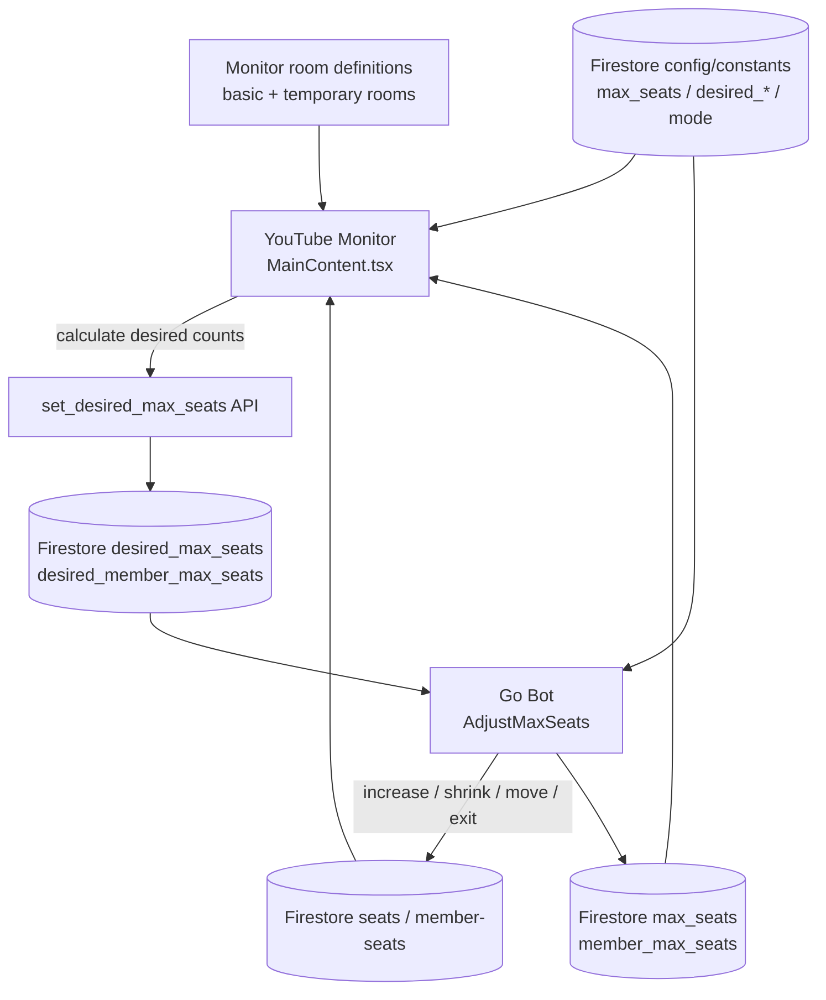

# Developer Architecture Notes

This document records architecture details that are easy to miss when changing one component in isolation. Runtime code and tests remain authoritative; update this document when the responsibility boundary changes.

## Room state and max-seat control

The livestream monitor is currently both a renderer and one participant in the max-seat control loop.

### Values with different roles

| Value | Role | Primary source/consumer |
| --- | --- | --- |
| `max_seats` / `member_max_seats` | Current seat-count limit used by the system. | Firestore `config/constants`; backend reconciliation and monitor layout construction |
| `desired_max_seats` / `desired_member_max_seats` | Requested target. The monitor writes these through the API; the Bot reconciles current limits toward them. | `set_desired_max_seats` Lambda, `WorkspaceApp.AdjustMaxSeats` |
| Basic room seat count | Capacity explicitly represented by the normal room-layout definitions. In fixed mode this becomes the requested capacity. | `youtube-monitor/src/rooms/rooms-config.ts` |
| Temporary rooms | Extra layouts used to cover variable capacity when more seats are required. | `youtube-monitor/src/rooms/rooms-config.ts`, layout builders |

### Fixed-seat mode

When `fixed_max_seats_enabled` is true, the monitor uses the total seats in the **basic room definitions** as the desired general capacity, and the corresponding fixed-member logic for member seats. Temporary rooms are not the mechanism for expanding fixed capacity.

On the backend, shrinking a fixed capacity is operationally significant: `max_seats_adjustment.go` can make users whose seat IDs are above the new limit exit. Therefore changing the number of seats in a basic layout can change system behavior even if the diff appears to be visual-only.

### Variable-seat mode

When fixed mode is disabled, the monitor calculates desired capacity from current occupancy, `min_vacancy_rate`, the basic-room capacity, and temporary-room definitions. Temporary rooms allow the UI to cover capacity beyond the basic rooms while the desired/current values converge.

The backend rejects a shrink that would violate the configured vacancy constraint. When shrinking is valid, users occupying seats above the new limit may be moved before `max_seats` is updated.

### Change checklist for monitor layouts

Before treating a layout change as visual-only, answer all of these:

1. Does the change alter the number of seats in any basic room?
2. Does it alter temporary-room capacity or ordering?
3. What desired counts are produced in fixed and variable modes?
4. Can any occupied seat ID become greater than the requested/current maximum?
5. Are general and member room calculations both covered?

See [`../../youtube-monitor/README.md`](../../youtube-monitor/README.md) for build/test setup.

## Firestore access boundaries

Server-side Go repository tests and browser Client SDK security rules answer different questions:

- normal `go test ./...` validates code without the integration build tag;
- `bash .github/scripts/run-firestore-integration-tests.sh` validates repository/application behavior against Firestore Emulator semantics;
- Firestore Security Rules govern what browser/client SDK callers can read/write and require client-oriented rule validation when that boundary changes.

See [`../../firebase/README.md`](../../firebase/README.md).

## Formal specifications

Seat behavior has formal-spec documentation under [`../../formal-spec/`](../../formal-spec/). The FSL documentation distinguishes contracts that are linked to Go verification from specifications that are currently descriptive/unlinked. Do not weaken a specification to make CI pass, and do not assume an unlinked specification is already enforced by the implementation.

## Privacy and retention

Changes to storage, forwarding, archival, or deletion must also be checked against [`../privacy/`](../privacy/). In particular, historical descriptions of raw live-chat archival must not be reintroduced as current architecture after that path has been retired.

## Current architecture vs desired direction

**Current fact:** the monitor participates in max-seat control as described above.

**Design direction:** prefer moving control decisions out of the presentation client so the monitor can eventually become a read/render-only component. This is a target boundary, not a statement that migration is complete. Until code changes remove the request path, reviews and tests must assume the current control loop exists.
