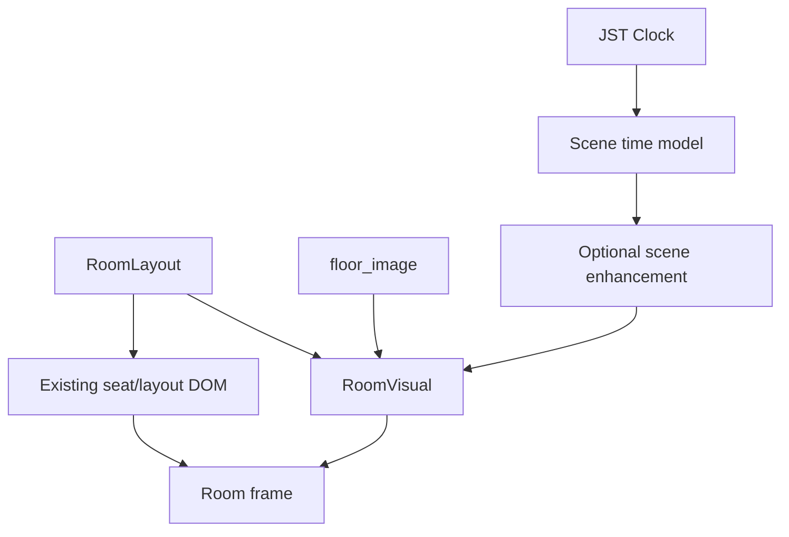

# Live Room Scenes technical design

This document is the implementation contract for incremental 2D motion in the YouTube livestream monitor. Product/visual intent is maintained in Notion's **Live Scene / Motion Bible v0.1**; this file records repository/runtime boundaries.

- Notion: https://app.notion.com/p/3d5357a8d0ce81748b20fe925228ab54
- Tracking issue: https://github.com/kani3camp/youtube-study-space/issues/1069

## Goal

Allow rooms to opt into time-aware ambient or living 2D visuals without making scene authoring a prerequisite for adding a room.

## Invariants

1. `floor_image` remains the static source and fallback.
2. A room with no `scene` config behaves as it does before this project.
3. Seat DOM, user/work labels, room capacity, page order, and max-seat control stay outside the scene renderer.
4. Page navigation is not delayed by scene initialization or asset loading.
5. Hidden pages must not keep expensive animation work running.
6. Runtime failures fall back to static rendering rather than blanking the room.

## Ownership boundary



### React / DOM owns

- room page selection and immediate page switching
- seat positions and seat state
- user display name and work content
- existing monitor UI
- current max-seat control behavior

### Scene layer owns

- background color grading
- sky/outside layers
- ambient/window/lamp light
- slow weather/environment motion
- renderer lifecycle and fallback

## Configuration levels

### Static

No `scene` property. Only `floor_image` is required.

### Ambient

```ts
scene: {
  mode: 'ambient',
  profile: 'neutral-interior',
}
```

Ambient must remain possible with the room image alone. Profile names and actual grading parameters are deferred to the Scene Clock/Ambient PR.

### Living

```ts
scene: {
  mode: 'living',
  profile: 'window-lounge',
}
```

Layer/asset schema is intentionally deferred until the renderer PR so the configuration is derived from implemented primitives instead of speculative types.

## Rollout stack

1. Static compatibility boundary and types.
2. Continuous Scene Clock and Ambient mode. **Implemented:** one JST clock writes CSS variables without per-frame React state; Ambient rooms consume a conservative CSS color-grade filter.
3. PixiJS/WebGL renderer lifecycle and fallback. **Implemented:** PixiJS is loaded only for Living rooms; one shared WebGL Application moves between active room hosts and stops on hidden pages.
4. One Living Room PoC. **Implemented on the integration branch:** Lume / Main Café Floor / Rainy uses slow window rain, continuous time tint, and lamp glow over the existing static room image.
5. Performance, asset lifecycle, context-loss/error handling. **Implemented:** Living rendering is capped at 30fps, transient initialization can retry, and an active scene can resume after WebGL context restoration without reviving a hidden room.
6. Production documentation, soak-test procedure, rollout controls. **Implemented:** fail-closed environment opt-in, production URL kill switch, and an OBS acceptance/rollback runbook.

All intermediate PRs target `feature/live-room-scenes`. Only the final integration PR targets `dev`, and that PR must not be merged by an agent.

## Verification strategy

Every stage keeps the smallest deterministic contract possible:

- component tests for static fallback/compatibility;
- unit tests for time interpolation and debug time;
- lifecycle/error tests around renderer activation and cleanup;
- normal monitor gates: `pnpm check`, `pnpm test --runInBand`, `pnpm build`;
- final runtime acceptance on the streaming PC in OBS at 1920x1080 / 30fps;
- long-running soak test before production enablement.

## Explicit non-goals

- 3D rendering
- camera-heavy room transitions
- changing page-switch behavior
- real weather API integration
- changing room seat counts or ordering
- requiring scene assets for every new room

## Scene Clock debug controls

Debug query parameters are honored only when `NEXT_PUBLIC_DEBUG=true`.

- `?sceneTime=17:30` freezes the Scene Clock at 17:30 JST.
- `?sceneSpeed=720` accelerates the current Scene Clock 720x.
- `?sceneTime=00:00&sceneSpeed=720` reviews a full 24-hour cycle in two real minutes.

The normal clock updates root CSS variables once per second without putting Scene Clock state into React render state. Static rooms do not consume these variables.

### Ambient implementation

Ambient remains an opt-in room mode and requires no assets beyond `floor_image`. The initial implementation applies a deliberately conservative CSS filter driven by continuous Scene Clock parameters. No existing production room is opted in by this PR, so rollout can be reviewed separately from the clock/runtime change.


## Living renderer runtime

Living mode keeps the static `floor_image` in the DOM at all times. The PixiJS canvas is a transparent enhancement layer above it.

Runtime rules:

- PixiJS is dynamically imported only when a Living room becomes active.
- One `Application` is shared by the browser tab rather than one WebGL context per room.
- The shared canvas is moved to the currently active Living room host.
- Hidden room pages deactivate the runtime and stop its ticker.
- A page switch never waits for PixiJS initialization; the static image is already visible.
- Initialization failure leaves the static image untouched.
- `webglcontextlost` hides/stops the enhancement layer and keeps the static fallback visible.
- The renderer explicitly prefers WebGL 2, transparent output, one physical output pixel per scene pixel, and a private ticker.

The renderer currently has no Living primitives or assets. Those are introduced by the PoC PR after the lifecycle boundary is verified.


## Lume Living PoC

The first Living profile is `lume-rainy-poc`, attached only to `CafeRainyRoom`.

The source room image already contains the architectural composition, rain-streaked glass, and warm practical lighting. The PoC therefore does **not** replace or split the static image. It adds only transparent vector primitives:

- 24 deterministic, slow rain streaks placed inside selected window panes;
- continuous base-image color grading from Scene Clock brightness / saturation / warmth / night values;
- a light full-room cool veil controlled by `--scene-night-amount`;
- a slightly stronger cool tint over window panes;
- a restrained sunset warmth veil controlled by `--scene-sunset-amount`;
- layered warm circles around existing lamp positions controlled by `--scene-lamp-intensity`.

Scene Clock CSS variables are sampled once per second and eased on the Pixi ticker. Rain position updates every frame, but the particle count is deliberately small to avoid high-frequency compression noise.

The profile is defined in the public codebase and requires no new binary scene assets. The existing room image remains deployment-provided and is still the complete fallback.

### Stacking invariant

Living effects render above the room image but below seat and partition UI:

1. static room image
2. Living Scene canvas
3. seat / partition UI

This ensures environmental motion cannot reduce seat text readability.


## Runtime hardening

The Living runtime is designed for a long-running OBS browser source rather than a short interactive session.

- Pixi's private ticker is capped at **30fps**, matching the target livestream frame rate and avoiding unnecessary 60fps scene updates.
- A failed initial Pixi/WebGL initialization leaves the static room visible and clears the cached failed promise. A later room activation can retry instead of permanently disabling Living scenes for the tab.
- On `webglcontextlost`, the active enhancement is stopped and hidden immediately while the static room remains visible.
- On `webglcontextrestored`, the previous Living scene is reactivated only when its host is still attached and has not been deactivated during the outage.
- Page switching or unmounting clears any pending recovery, so a previously visible room cannot unexpectedly restart after a delayed WebGL restore.
- Destroy removes both context-loss and context-restored listeners and invalidates pending recovery.

This recovery path deliberately does not add a separate timer/polling loop. Browser context restoration remains event-driven, while ordinary page activity remains controlled by the existing room `display` state.


## Rollout controls

Live Room Scenes do not activate merely because a room contains a `scene` config.

- `NEXT_PUBLIC_LIVE_ROOM_SCENES_ENABLED=true` is required to enable Ambient/Living rendering in a normal build.
- Missing, `false`, or any other value keeps room rendering Static.
- `?liveScenes=off`, `false`, or `0` disables scenes at runtime even when the build is enabled. This is the production emergency kill switch.
- URL force-on is restricted to DEBUG builds: `?liveScenes=on`, `true`, or `1`.
- Until Next router query state is ready, scenes remain disabled. This prevents a short Living flash before a URL kill switch is parsed.
- When scenes are disabled, the Scene Clock CSS-variable interval does not run and Living canvases are not mounted.

Operational verification and rollback steps are documented in [Live Room Scenes rollout runbook](./live-room-scenes-rollout.md).
