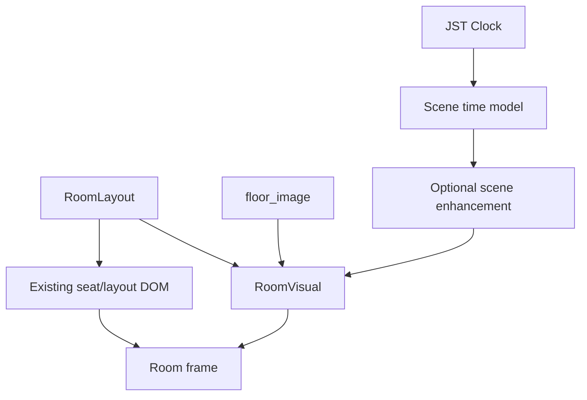

# Live Room Scenes technical design

This document is the implementation contract for incremental 2D motion in the YouTube livestream monitor. Product/visual intent is maintained in Notion's **Live Scene / Motion Bible v0.1**; this file records repository/runtime boundaries.

- Notion: https://app.notion.com/p/3d5357a8d0ce81748b20fe925228ab54
- Tracking issue: https://github.com/kani3camp/youtube-study-space/issues/1069

## Goal

Allow rooms to opt into time-aware ambient or living 2D visuals without making scene authoring a prerequisite for adding a room.

## Invariants

1. `floor_image` remains the static source and fallback.
2. A room with no `scene` config behaves as it does before this project.
3. Seat DOM, user/work labels, room capacity, page order, and max-seat control stay outside the scene renderer.
4. Page navigation is not delayed by scene initialization or asset loading.
5. Hidden pages must not keep expensive animation work running.
6. Runtime failures fall back to static rendering rather than blanking the room.

## Ownership boundary



### React / DOM owns

- room page selection and immediate page switching
- seat positions and seat state
- user display name and work content
- existing monitor UI
- current max-seat control behavior

### Scene layer owns

- background color grading
- sky/outside layers
- ambient/window/lamp light
- slow weather/environment motion
- renderer lifecycle and fallback

## Configuration levels

### Static

No `scene` property. Only `floor_image` is required.

### Ambient

```ts
scene: {
  mode: 'ambient',
  profile: 'neutral-interior',
}
```

Ambient must remain possible with the room image alone. Profile names and actual grading parameters are deferred to the Scene Clock/Ambient PR.

### Living

```ts
scene: {
  mode: 'living',
  profile: 'window-lounge',
}
```

Layer/asset schema is intentionally deferred until the renderer PR so the configuration is derived from implemented primitives instead of speculative types.

## Rollout stack

1. Static compatibility boundary and types.
2. Continuous Scene Clock and Ambient mode.
3. PixiJS/WebGL renderer lifecycle and fallback.
4. One Living Room PoC.
5. Performance, asset lifecycle, context-loss/error handling.
6. Production documentation, soak-test procedure, rollout controls.

All intermediate PRs target `feature/live-room-scenes`. Only the final integration PR targets `dev`, and that PR must not be merged by an agent.

## Verification strategy

Every stage keeps the smallest deterministic contract possible:

- component tests for static fallback/compatibility;
- unit tests for time interpolation and debug time;
- lifecycle/error tests around renderer activation and cleanup;
- normal monitor gates: `pnpm check`, `pnpm test --runInBand`, `pnpm build`;
- final runtime acceptance on the streaming PC in OBS at 1920x1080 / 30fps;
- long-running soak test before production enablement.

## Explicit non-goals

- 3D rendering
- camera-heavy room transitions
- changing page-switch behavior
- real weather API integration
- changing room seat counts or ordering
- requiring scene assets for every new room
