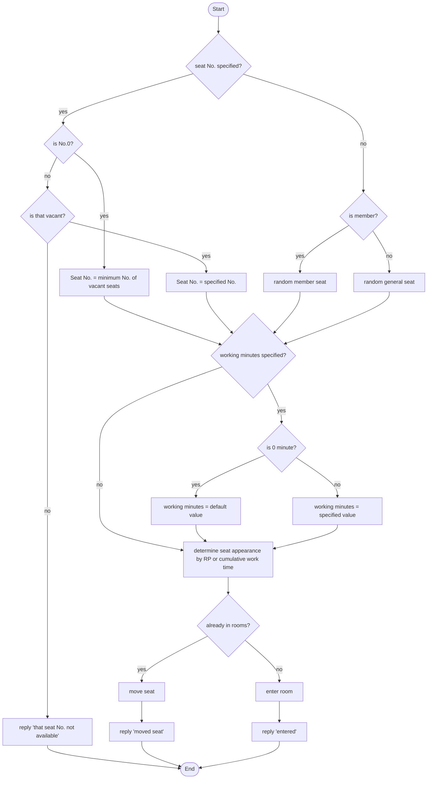
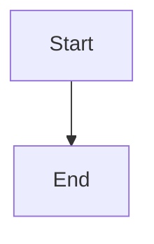

## `!in` command

```mermaid
flowchart TD
Start([Start]) --> 1{seat No. specified?}
1 -->|yes| 1A{is No.0?}
1 -->|no| 7
1A -->|yes| 1AA[Seat No. = minimum No. of vacant seats] --> 2
1A -->|no| 1AB{is that vacant?}
1AB -->|yes| 1ABA[Seat No. = specified No.] --> 2
1AB -->|no| 1ABB[reply 'that seat No. not available'] --> End

2{working minutes specified?}
2 -->|yes| 2A{is 0 minute?}
2 -->|no| 3
2A --> |yes| 2AA[working minutes = default value] --> 3
2A --> |no| 2AB[working minutes = specified value] --> 3

3[determine seat appearance by RP or cumulative work time] --> 4{already in rooms?}
4 --> |yes| 4A[move seat] --> 5[reply 'moved seat'] --> End
4 --> |no| 4B[enter room] --> 6[reply 'entered'] --> End

7{is member?}
7 --> |yes| 7A[random member seat] --> 2
7 --> |no| 7B[random general seat] --> 2


End([End])    
```

## `!out` command

```mermaid
flowchart TD
    Start --> End
```