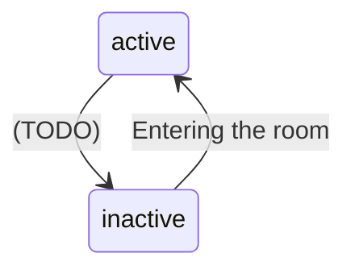
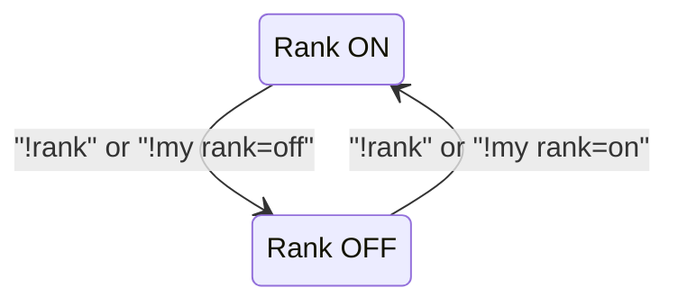

```mermaid
stateDiagram-v2
    active --> inactive: (TODO)
    inactive --> active: Entering the room
```

```mermaid
stateDiagram-v2
    state "Rank ON" as on
    state "Rank OFF" as off
    
    on --> off: "!rank" or "!my rank=off"
    off --> on: "!rank" or "!my rank=on"
```

